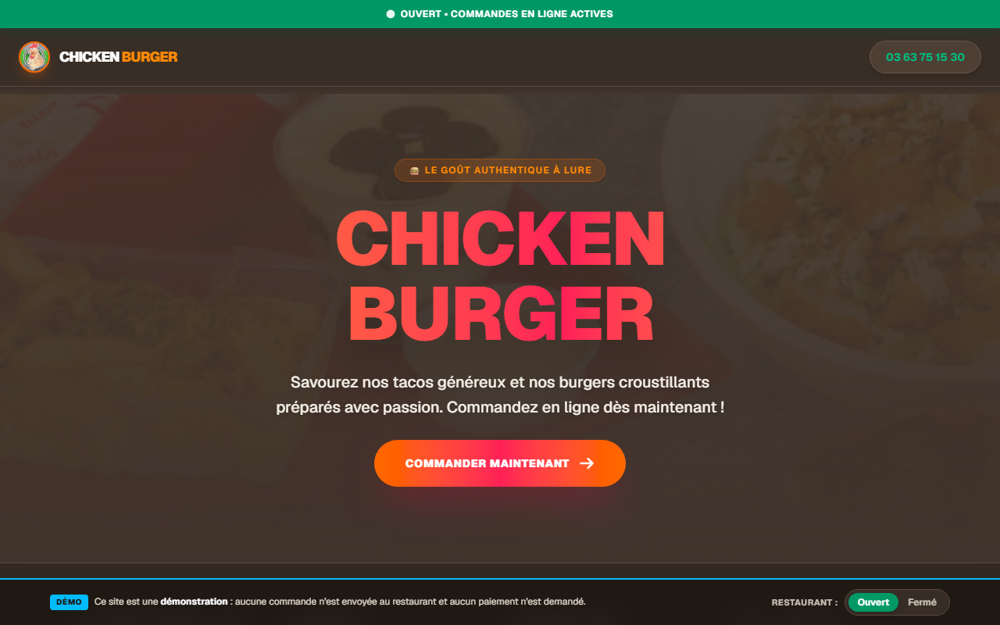
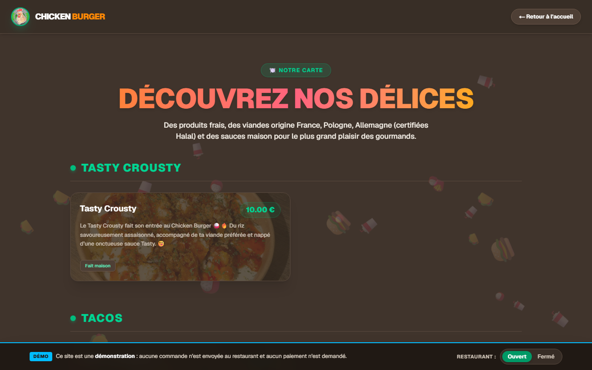
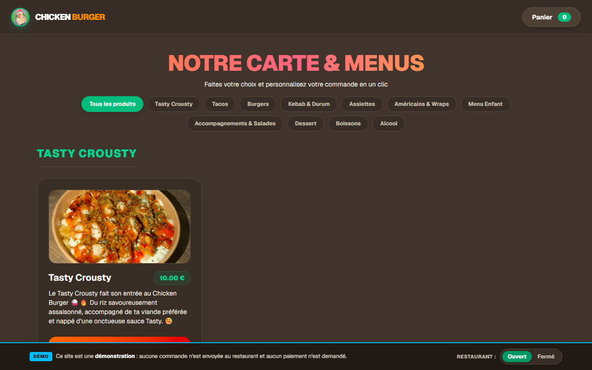

# 🍔 Chicken Burger — site de commande en ligne

Site vitrine et de commande en ligne de **Chicken Burger**, restaurant de burgers et tacos à Lure (70).
Les clients consultent la carte, composent leur commande et suivent sa préparation ; le restaurant gère les commandes et les stocks depuis un espace admin.

### ▶️ [Voir la démo en ligne](https://studiopixeldesigner.github.io/demo.chickenburger/)

> [!NOTE]
> La démo est une version de présentation : **aucune commande n'est envoyée au restaurant** et aucun paiement n'est demandé. Un bandeau en bas de page permet de passer le restaurant en **ouvert** ou **fermé** pour tester les deux situations.



## Fonctionnalités

### Côté client

- **Statut en temps réel** : ouvert ou fermé selon les horaires, avec fermeture exceptionnelle ou ouverture forcée pilotées depuis l'admin
- **Carte** classée par catégories, chargée depuis la base de données
- **Commande en ligne** : filtres par catégorie, personnalisation (viandes, galettes, sauces, options, formule menu avec boisson), produits en rupture signalés, note pour la cuisine
- **Panier conservé** dans le navigateur, même après avoir fermé la page
- **Suivi de commande** par numéro de commande ou numéro de téléphone
- Pages **Provenance des viandes** et **Mentions légales**

### Côté restaurant (espace admin)

- Accès protégé par mot de passe
- **Commandes** : liste actualisée toutes les 30 secondes, alerte sonore à chaque nouvelle commande, passage de « En préparation » à « Prête »
- **Ouverture / fermeture** du restaurant en un clic, en dehors des horaires habituels
- **Gestion de la carte et des stocks** : produits avec photo, options, catégories réordonnables, types d'options (nombre de choix, obligatoire ou non, réglages par produit), ruptures de stock

> L'espace admin n'est pas inclus dans la démo en ligne : il a besoin d'un serveur, alors que la démo est un site statique.

## Aperçu

| Carte | Commande en ligne |
| --- | --- |
|  |  |

## Technologies

- [Next.js 16](https://nextjs.org) (App Router) avec React 19 et TypeScript
- [Tailwind CSS 4](https://tailwindcss.com)
- [Supabase](https://supabase.com) : base de données PostgreSQL et stockage des photos
- GitHub Actions et GitHub Pages pour la démo

## Lancer le projet en local

1. Installer les dépendances :

   ```bash
   npm install
   ```

2. Créer un fichier `.env.local` à la racine :

   ```bash
   NEXT_PUBLIC_SUPABASE_URL=https://<projet>.supabase.co
   NEXT_PUBLIC_SUPABASE_ANON_KEY=<clé publique Supabase>
   SUPABASE_SERVICE_ROLE_KEY=<clé service Supabase>   # utilisée par l'admin, ne jamais la publier
   ADMIN_PASSWORD=<mot de passe de l'espace admin>
   ```

3. Démarrer le serveur de développement :

   ```bash
   npm run dev
   ```

Le site est disponible sur [http://localhost:3000](http://localhost:3000) et l'espace admin sur [http://localhost:3000/admin](http://localhost:3000/admin).

## Déploiement de la démo

Chaque push sur `main` lance le workflow [`.github/workflows/deploy.yml`](.github/workflows/deploy.yml), qui :

1. construit une version statique du site (`output: 'export'`), sans l'espace admin ;
2. active le mode démo (`NEXT_PUBLIC_DEMO_MODE=true`) : bandeau d'information, état ouvert/fermé au choix du visiteur, commandes simulées et suivi désactivé ;
3. publie le résultat sur GitHub Pages.

Le workflow a besoin de `NEXT_PUBLIC_SUPABASE_URL` et `NEXT_PUBLIC_SUPABASE_ANON_KEY`, à définir dans **Settings → Secrets and variables → Actions** (en secrets ou en variables).

## Structure

```
app/
├── page.tsx               Accueil
├── menu/                  Carte
├── commander/             Commande en ligne
├── suivi/                 Suivi de commande
├── provenance-viandes/    Provenance des viandes
├── mentions-legales/      Mentions légales
├── admin/                 Espace restaurant (commandes, stocks)
├── actions/               Server Actions (authentification, gestion de la carte)
└── demo-banner.tsx        Bandeau du mode démo
lib/
├── supabase.ts            Client Supabase
├── demo.ts                Mode démo
└── base-path.ts           Chemins des images pour GitHub Pages
```

---

Conçu et développé par [Pixel Designer](https://studiopixeldesigner.github.io/pixeldesigner).
