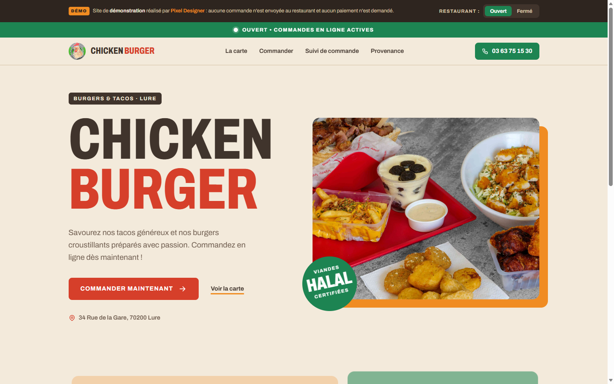
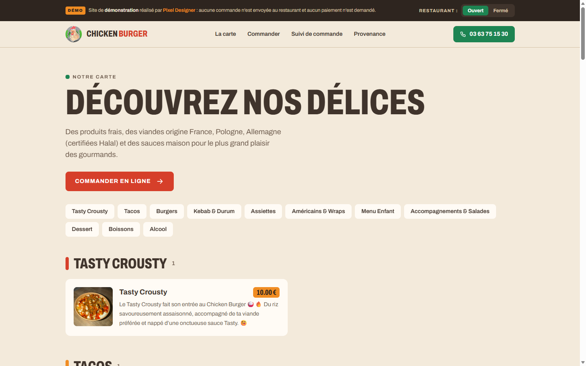
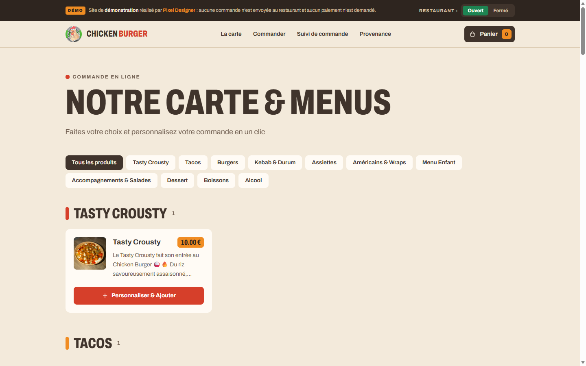
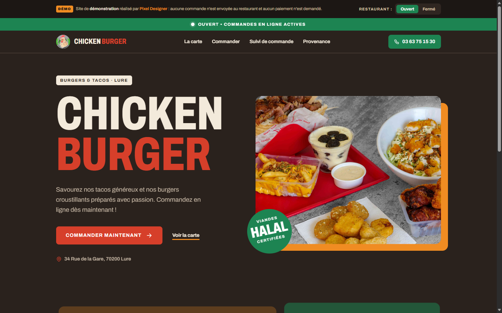

# 🍔 Chicken Burger — démo du site de commande en ligne

Version de démonstration du site de **Chicken Burger**, restaurant de burgers et tacos à Lure (70).
Les visiteurs consultent la carte, composent leur commande et suivent sa préparation.

### ▶️ [Voir la démo en ligne](https://studiopixeldesigner.github.io/demo.chickenburger/)

> [!NOTE]
> La démo est une version de présentation : **aucune commande n'est envoyée au restaurant** et aucun paiement n'est demandé. Un bandeau en haut de page permet de passer le restaurant en **ouvert** ou **fermé** pour tester les deux situations.



## Fonctionnalités

- **Statut du restaurant** : ouvert ou fermé, au choix du visiteur dans le bandeau de démo
- **Carte** classée par catégories, chargée depuis la base de données
- **Commande en ligne** : filtres par catégorie, personnalisation (viandes, galettes, sauces, options, formule menu avec boisson), produits en rupture signalés, note pour la cuisine
- **Panier conservé** dans le navigateur, même après avoir fermé la page
- **Commandes simulées** : elles restent dans le navigateur du visiteur, avec un numéro de commande
- **Suivi de commande** par numéro de commande ou de téléphone ; en démo, la commande passe « prête » au bout d'une minute
- Pages **Provenance des viandes** et **Mentions légales**
- **Design Flat** aux couleurs du restaurant, animations sobres et **mode sombre automatique** selon le réglage de l'appareil

> Le site réel comprend aussi un espace restaurant (commandes, ouverture et fermeture, gestion de la carte et des stocks). Il n'est pas inclus ici : il a besoin d'un serveur, alors que la démo est un site statique.

## Aperçu

| Carte | Commande en ligne |
| --- | --- |
|  |  |

| Mode sombre |
| --- |
|  |

## Technologies

- [Next.js 16](https://nextjs.org) (App Router) avec React 19 et TypeScript
- [Tailwind CSS 4](https://tailwindcss.com)
- [Supabase](https://supabase.com) : base de données PostgreSQL et stockage des photos (lecture seule dans la démo)
- GitHub Actions et GitHub Pages pour la mise en ligne

## Lancer la démo en local

Double-cliquer sur **`Lancer la démo.bat`** : le site s'ouvre sur [http://localhost:3001](http://localhost:3001).

Ou à la main :

1. Installer les dépendances :

   ```bash
   npm install
   ```

2. Créer un fichier `.env.local` à la racine, avec uniquement les clés publiques :

   ```bash
   NEXT_PUBLIC_SUPABASE_URL=https://<projet>.supabase.co
   NEXT_PUBLIC_SUPABASE_ANON_KEY=<clé publique Supabase>
   NEXT_PUBLIC_DEMO_MODE=true
   ```

3. Démarrer le serveur de développement :

   ```bash
   npm run dev -- -p 3001
   ```

## Déploiement

Chaque push sur `main` lance le workflow [`.github/workflows/deploy.yml`](.github/workflows/deploy.yml), qui :

1. construit une version statique du site (`output: 'export'`) ;
2. active le mode démo (`NEXT_PUBLIC_DEMO_MODE=true`) : bandeau d'information, état ouvert/fermé au choix du visiteur, commandes et suivi simulés, page non indexée par les moteurs de recherche ;
3. publie le résultat sur GitHub Pages.

Le workflow a besoin de `NEXT_PUBLIC_SUPABASE_URL` et `NEXT_PUBLIC_SUPABASE_ANON_KEY`, à définir dans **Settings → Secrets and variables → Actions** (en secrets ou en variables).

## Structure

```
app/
├── page.tsx               Accueil
├── menu/                  Carte
├── commander/             Commande en ligne
├── suivi/                 Suivi de commande
├── provenance-viandes/    Provenance des viandes
├── mentions-legales/      Mentions légales
└── _components/           En-tête, pied de page, bandeau de démo, icônes et éléments d'interface
lib/
├── supabase.ts            Client Supabase
├── demo.ts                Mode démo (état du restaurant, commandes simulées)
└── base-path.ts           Chemins des images pour GitHub Pages
```

---

Conçu et développé par [Pixel Designer](https://studiopixeldesigner.github.io/pixeldesigner).
